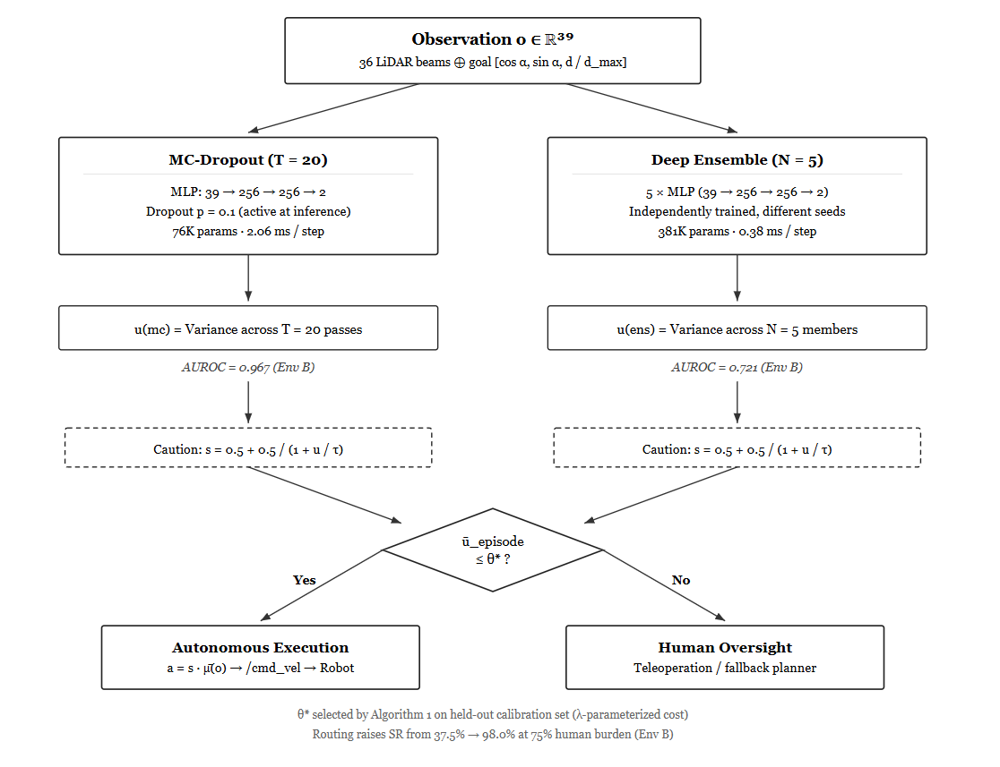

# Uncertainty-Gated Selective Deployment (UGSD)

**When should a robot navigate autonomously, and when should it ask for help?**

This framework answers that question. UGSD combines epistemic uncertainty estimation with an adaptive routing policy to decide on a per-episode basis, whether a navigation agent should act autonomously or defer to human oversight. On the hardest out-of-distribution environment, UGSD raises autonomous success rate from 37.5% to 98.0% by routing uncertain episodes to humans.

[](https://docs.ros.org/en/humble/)
[](https://classic.gazebosim.org/)
[](https://www.python.org/)
[](https://pytorch.org/)
[](LICENSE)


---

## The Problem

RL navigation policies fail silently under distribution shift. A robot trained in one environment will confidently drive into walls in a new one with no warning signal. Existing approaches either:
- Improve the policy (doesn't help when the environment is genuinely novel)
- Use memory (LSTM/GRU — point estimates that can't quantify "I don't know")

**UGSD takes a different approach:** instead of trying to navigate better, it learns to *know when not to navigate*.

## Key Results

| Metric | Value |
|--------|-------|
| MC-Dropout AUROC (failure prediction, Env B) | **0.967** |
| Deep Ensemble AUROC (same task) | 0.721 |
| Routing Q0 SR (75% human burden) | **98.0%** |
| Unrouted SR (same environment) | 37.5% |
| MC-Dropout params | 76K (single network) |
| Ensemble params | 381K (5 networks) |
| Inference latency (T=20, CPU) | 2.06 ms |

MC-Dropout with 5× fewer parameters achieves higher AUROC than the deep ensemble on every out-of-distribution environment.


## How It Works

UGSD has four components that work together. Here's each one in detail.

---

### 1. Distribution Shift Decomposition

**The question:** When a robot fails in a new environment, *why* did it fail? Was it the degraded sensors? The unfamiliar layout? Both?

We propose something more principled — a **2×2 factorial design** that isolates each shift axis independently:

```
                    Sensors: Same as training    Sensors: Degraded
                   ┌──────────────────────────┬──────────────────────────┐
 Layout: Same      │  Env A (training)         │  Env C (sensor-only)     │
 as training       │  10×10m, 8 obstacles       │  Same layout, but:       │
                   │  180° FoV, low noise       │  120° FoV, 2.4× noise    │
                   │  SR ≈ 99% (all methods)    │  20% beam occlusion      │
                   ├──────────────────────────┼──────────────────────────┤
 Layout: Novel     │  Env D (layout-only)       │  Env B (compound)        │
                   │  12×12m, 10 obstacles       │  Everything changes:     │
                   │  + 2 interior walls         │  New layout + degraded   │
                   │  + 2 dynamic obstacles      │  sensors simultaneously  │
                   │  Clean sensors              │  Hardest environment     │
                   └──────────────────────────┴──────────────────────────┘
```

**What we found:**
- Sensor degradation alone (Env C) barely increases uncertainty — ensemble ū goes from 0.283 → 0.261
- Layout novelty alone (Env D) dramatically increases it — ensemble ū jumps to 0.711
- The ratio is **2.7×** for the ensemble and **3.2×** for MC-Dropout
- Compound shift (Env B) produces **41% more** uncertainty than the sum of individual shifts — the effects are synergistic, not additive

---

### 2. Uncertainty Estimation

**The core idea:** Instead of asking "what action should I take?", ask "how confident am I in this action?" If confidence is low, slow down or ask for help.

We compare two approaches on the exact same task, same observations, same reward:

#### MC-Dropout (our recommended method)

```
Single MLP (76K params):  Input(39) → Dense(256) → ReLU → Dropout(p=0.1)
                                    → Dense(256) → ReLU → Dropout(p=0.1)
                                    → Output(2) [linear vel, angular vel]
```

At inference, dropout stays ON. Run the same observation through the network T=20 times — each time, different neurons are randomly dropped, producing slightly different action predictions.

```python
# Pseudocode for MC-Dropout uncertainty
actions = []
for k in range(T=20):
    action_k = network.forward(obs)  # dropout ON → different each time
    actions.append(action_k)

mean_action = mean(actions)           # consensus action
uncertainty = variance(actions)        # disagreement = uncertainty
```

If the network is confident, all 20 passes agree → low variance.
If the input is unfamiliar, passes disagree → high variance.

**Cost:** 76K params, 2.06 ms for 20 passes on CPU.

#### Deep Ensemble

```
5 independently trained MLPs, each 76K params:
  Member 0: trained with seed=0 on its own trajectory rollouts
  Member 1: trained with seed=1 on its own trajectory rollouts
  ...
  Member 4: trained with seed=4 on its own trajectory rollouts
```

Each member converges to a different local optimum. At inference, all 5 predict an action. Uncertainty = variance across members.

**Cost:** 381K params total (5×76K), 0.38 ms (parallel forward passes).

#### Why MC-Dropout Wins

On Env B (compound shift), the ensemble's AUROC drops to 0.721 while MC-Dropout maintains 0.967. Three reasons:

1. **Diversity collapse.** We measured pairwise cosine similarity between ensemble member predictions. On Env B failure episodes, members have cosine similarity 0.845 — they agree on the *wrong* action. On Env A (training), failure episodes show 0.719 similarity — the ensemble *can* detect failures in-distribution, but this ability collapses under compound shift.

2. **Uncertainty saturation.** On Env B, the ensemble's cautious ratio hits 100% — every single step triggers the caution mechanism. When uncertainty is uniformly high, it can't distinguish "slightly OOD" from "catastrophically OOD."

3. **Layer-wise vs output-level perturbation.** MC-Dropout injects noise at every hidden layer, probing whether intermediate representations are stable. The ensemble only measures disagreement at the output layer. When all members are confused in the same way (correlated errors), output disagreement vanishes — but MC-Dropout's internal perturbations still detect instability.

---

### 3. Selective Deployment (Routing)

**The insight:** You don't need 100% autonomous success rate. You need to know *which* episodes to handle autonomously and which to hand off.

After an episode runs, we compute its mean uncertainty ū. Episodes are sorted into quartiles:

```
Q0 (lowest 25% uncertainty)  → Most confident  → Run autonomously
Q1 (25-50%)                  → Moderate         → Run autonomously or route
Q2 (50-75%)                  → Uncertain        → Route to human
Q3 (highest 25% uncertainty) → Most uncertain   → Definitely route to human
```

The results on Env B (the hardest environment):

```
┌─────────────────────────────────────────────────────────────────┐
│  Strategy          │ Autonomous SR │ Auto % │ Human Burden      │
├─────────────────────────────────────────────────────────────────┤
│  No routing        │    37.5%      │  100%  │     0%            │
│  Route Q3          │    50.0%      │   75%  │    25%            │
│  Route Q2+Q3       │    73.0%      │   50%  │    50%            │
│  Only Q0           │    98.0%      │   25%  │    75%            │
├─────────────────────────────────────────────────────────────────┤
│  Ensemble Only Q0  │    52.8%      │   25%  │    75%  (compare) │
└─────────────────────────────────────────────────────────────────┘
```

At 75% human burden, MC-Dropout achieves **98.0%** autonomous SR vs the ensemble's **52.8%**. The uncertainty signal quality directly determines routing effectiveness.

**Algorithm 1 (Adaptive Threshold Routing):** Rather than fixed quartiles, we also provide an algorithm that sweeps over possible thresholds on a calibration set and selects the one that optimizes a λ-parameterized trade-off between human burden and autonomous safety. The quartile strategies shown above correspond to specific operating points this algorithm would select.

---

### 4. Post-Hoc Calibration

**The problem:** MC-Dropout's uncertainty is great for *ranking* (high AUROC) but bad for *absolute probability estimation* (high ECE). An uncertainty of 0.015 doesn't mean "1.5% chance of failure" — the raw numbers aren't calibrated.

**The fix:** Temperature scaling. We fit a single parameter T_cal on a held-out calibration set:

$$p_{\text{fail}}(u) = \sigma\\left(\frac{\log(u / u_{\text{med}})}{T_{\text{cal}}}\right)$$


This transforms the raw uncertainty into a calibrated failure probability without changing the ranking (sigmoid is monotonic → AUROC preserved).

**Results:**

| Environment | Raw ECE | Calibrated ECE | Reduction | T_cal |
|-------------|---------|----------------|-----------|-------|
| Env B (compound) | 0.538 | 0.264 | −51% | 1.76 |
| Env D (layout) | 0.469 | 0.084 | −82% | 0.16 |
| Env A (training) | — | — | ill-conditioned | — |
| Env C (sensor) | — | — | ill-conditioned | — |

Env A and C have too few failures (<8%) for meaningful calibration — the uncertainty is already near-perfectly discriminative there.

With calibrated uncertainty, you can make risk-aware decisions: "this episode has a 40% predicted failure probability — route to human" rather than just "this episode has higher uncertainty than average."

---

### 5. Robustness Validation

To confirm that OOD degradation comes from structural novelty (not sensor noise), we sweep laser noise σ from 0.0 to 0.3 m on the training layout:

```
σ = 0.00  │  MC-Drop: 1.00   Ensemble: 1.00   Vanilla: 0.96
σ = 0.05  │  MC-Drop: 1.00   Ensemble: 1.00   Vanilla: 1.00
σ = 0.10  │  MC-Drop: 0.98   Ensemble: 0.98   Vanilla: 0.96
σ = 0.15  │  MC-Drop: 1.00   Ensemble: 1.00   Vanilla: 0.88  ← baseline dips
σ = 0.20  │  MC-Drop: 1.00   Ensemble: 1.00   Vanilla: 1.00
σ = 0.30  │  MC-Drop: 1.00   Ensemble: 1.00   Vanilla: 0.96
```

Uncertainty-aware methods (MC-Dropout, Ensemble) maintain SR ≥ 0.96 across the full range. Baselines show occasional dips. The policies are robust to sensor noise within the training layout — performance drops on Env B/C/D come from structural changes, not noise sensitivity.

---

## Architecture



| Symbol | Meaning |
|--------|---------|
| **o ∈ ℝ³⁹** | Observation vector — 36 LiDAR range readings + 3 goal-relative values |
| **μ(o)** | Mean action output from the policy network |
| **u(mc)** | MC-Dropout uncertainty — variance across T stochastic forward passes |
| **u(ens)** | Ensemble uncertainty — variance across N independently trained members |
| **T = 20** | Number of dropout-enabled forward passes at inference |
| **N = 5** | Number of ensemble members |
| **s** | Caution scale factor — smoothly reduces velocity when uncertainty is high |
| **τ** | Caution temperature (τ = 0.5) — controls how aggressively speed is reduced |
| **ū(episode)** | Mean per-step uncertainty averaged over an entire episode |
| **θ*** | Routing threshold — episodes above this are handed to a human operator |
| **λ** | Trade-off parameter in Algorithm 1 — balances human burden vs autonomous safety |
| **AUROC** | Area Under ROC — measures how well uncertainty separates failures from successes |
| **/cmd_vel** | ROS 2 velocity command topic — the robot's motor input |
---

## Reproducibility

Every result in the paper can be regenerated from checkpoints with a single command:

```bash
bash reproduce.sh
```

This runs all 10 steps (~45-60 min on CPU):
1. Baselines × 4 environments
2. Ensemble × 4 environments
3. MC-Dropout × 4 environments × T={5,10,20}
4. Ensemble size ablation (N=1,2,3,5,10)
5. Threshold/capacity ablations
6. Ensemble size AUROC
7. Noise sweep (robustness)
8. Temperature scaling + cosine similarity + latency + bootstrap CIs
9. All figures
10. Full audit (printed to `reproduce_audit.txt`)

Output: `experiments/results/*.json` (40 files), `experiments/plots/*.pdf` (8 figures)


## Installation

### Prerequisites

- Ubuntu 20.04/22.04 (tested on WSL2)
- Python 3.10+
- ROS 2 Humble (for Gazebo deployment only)

### Quick Start

```bash
# Clone
git clone https://github.com/newton-adhikari/uncertainty_nav.git
cd uncertainty_nav

# Install dependencies
pip install -r requirements.txt
pip install -e src/uncertainty_nav
pip install scipy scikit-learn

# Run full evaluation pipeline
bash reproduce.sh
```

### ROS 2 / Gazebo Deployment

```bash
# Source ROS 2
source /opt/ros/humble/setup.bash

# Build
cd uncertainty_nav
colcon build --symlink-install
source install/setup.bash

# Launch full system (Env A)
ros2 launch uncertainty_nav full_system.launch.py env:=A \
    checkpoint:=$(pwd)/checkpoints/ensemble_policy.pt

# Launch with Env B (compound OOD)
ros2 launch uncertainty_nav full_system.launch.py env:=B \
    checkpoint:=$(pwd)/checkpoints/ensemble_policy.pt
```

---

## Project Structure

```
uncertainty_nav/
├── checkpoints/                    
│   ├── ensemble_m{0-9}_policy.pt   
│   ├── mc_dropout_policy.pt       
│   ├── vanilla_policy.pt           
│   ├── lstm_policy.pt              
│   ├── gru_policy.pt               
│   └── large_mlp_policy.pt         
├── experiments/
│   ├── results/                    
│   └── plots/                      
├── src/uncertainty_nav/
│   └── uncertainty_nav/
│       ├── nav_env.py              
│       ├── models.py               
│       ├── mc_dropout.py           # MC-Dropout policy
│       ├── baselines.py            
│       └── uncertainty_agent_node.py  # ROS 2 deployment node
├── scripts/
│   ├── eval/                       
│   │   ├── evaluate.py             
│   │   ├── plot_results.py         
│   │   ├── compute_temperature_scaling.py
│   │   ├── compute_cosine_similarity.py
│   │   ├── compute_auroc_ci.py     # Bootstrap CIs
│   │   └── measure_inference_latency.py
│   └── ablation/
│       └── run_ablations.py        
├── reproduce.sh                    
└── requirements.txt
```

---

## Environment Configurations

| Parameter | Env A (train) | Env C (sensor) | Env D (layout) | Env B (both) |
|-----------|:---:|:---:|:---:|:---:|
| Arena | 10×10 m | 10×10 m | 12×12 m | 12×12 m |
| Static obstacles | 8 | 8 | 10 | 10 |
| Dynamic obstacles | 0 | 0 | 2 | 2 |
| Interior walls | 0 | 0 | 2 | 2 |
| Noise σ | 0.05 | 0.12 | 0.05 | 0.12 |
| Occlusion | 0.05 | 0.20 | 0.05 | 0.20 |
| FoV | 180° | 120° | 180° | 120° |


---

## License

MIT License. See [LICENSE](LICENSE) for details.

## Acknowledgments

Built on ROS 2, Gazebo, PyTorch, and Gymnasium. Trained and evaluated on a TurtleBot3 Waffle Pi platform in simulation.
